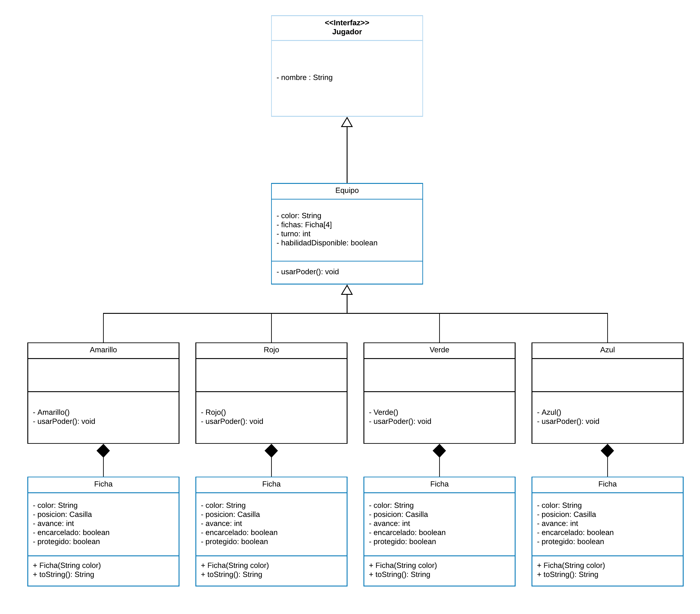
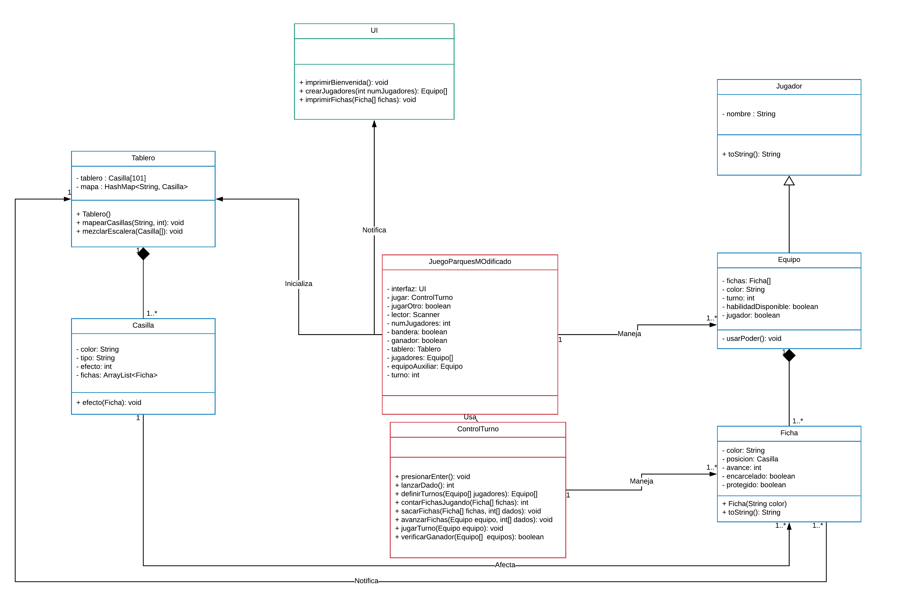

<h1>DETAILED DESCRIPTION OF THE PROJECT - MODIFIED PARCHESSI GAME</h1>

<h2>AUTHORS: </h2>

Julian Eduardo Ariza Arevalo

Fabian Stiven Abreo Cubides

Ivonne Nathalia Uribe Lara

<h2>INTRODUCTION</h2>

Adapted from the American board game Parchessi, that in turn, it is adapted from the Indian board game Parchisi, the objective is to take the pawns of each player to a common goal, by means of the advance determined by the value of a pair of dice. 

The ladder is a low complexity board game similar to parchessi, but it has shortcuts and traps that allow a player to advance or delay. The parchessi modified in this project will be essentially a parchessi board with the shortcuts and traps of the ladder game, additionaly, each team has a special ability that will allow them to add more strategic character to the game.

<h2>Detailed description: </h2>

The rules of the game to be implemented are detailed below.
<ul>
    <li>The essence of the game is a 4-player board game.</li>
    <li>The board has the following form:
            
    </li>
    <li>Each team has four tiles.</li>
    <li>Each team has a different color.</li>
    <li>Each color has an ability that can only be used once.</li>
    <li>The board has random squares that advance or rewind the player's piece.</li>
    <li>The board is divided into four regions for the four teams.
        <ul>
            <li>Each region has 24 squares and a jail.</li>
            <li>7/24 spaces are the way to victory for the exclusive use of the team in the region.</li>
            <li>2/24 are safe.</li>
            <li>1/24 is output.</li>
            <li>14/24 are regular squares.</li>
            <li>2/14 regular squares have effects. One advance and one delay.</li>
            <li>The victory zone is common for all four teams.</li>
        </ul>
    </li>
    <li>The player with the highest value on a die starts the game.</li>
    <li>Play continues in the counterclockwise direction of the player with the first turn.</li>
    <li>Each player can roll the dice three times to put pawns into play if they don't have any.</li>
    <li>If the player has at least one pawn in play, he can only roll the dice once.</li>
    <li>For each doublet with the dice the turn is repeated.</li>
    <li>Three doublets in a row send a pawn desired by the player to the goal.</li>
    <li>With a doublet of dice, the player removes two jail pawns to play.</li>
    <li>With a doublet of 6 or 1 all the jail pawns are moved to play.</li>
    <li>If a player is in a square and the result of another player's turn is to land on the same square, the player who was first goes to jail.</li>
    <li>There are safe effect boxes that do not allow you to send to jail.</li>
    <li>The exit spaces have a certain effect, only the owner of the color can send to jail when there is another player in their exit space.</li>
    <li>Powers</li>
    <ul>
        <li>The player can use the respective result of the dice for one or two tiles respectively.</li>
        <li>The power of the red token is not to be affected once by recoil squares.</li>
        <li>The power of the yellow chip is to increase a single time by 1.5 rounded up the value of one space ahead.</li>
        <li>The power of the blue token is to re-roll a single die once as desired again before making the move.</li>
        <li>The power of the green token is that it cannot be sent to jail by the next player who can land on its square.</li>
        <li>Powers can only be used on the respective turns.</li>
    </ul>  
    <li>The player who has all the tiles in the goal wins the game.</li>
    <li>The game ends when there is a winner.</li>
</ul>

CLASS DEFINITION.

This modified park game consists of 8 classes that are:

PLAYER: the player will not have any attributes since it is an interface and we do not need any final characteristic attributes but it will have a method that will be to roll the dice (+ rollDice () : void).

TEAM: mainly the team is made up of tokens, in addition to this it has the following attributes: a color to differentiate itself (String), a list of four instances of the class token of which it is composed (array), a turn (int) , a power that will change according to which team it is (String) and finally the attribute "available ability" that allows to know if the power was used or not (boolean). This class will not have any method.
SHEET: consists of the following attributes: the team attribute that will be the color of the team to which the tile belongs (string), a position that will be the box in which the tile is currently (Box), it will have an advance that will be in charge of add or subtract a whole number depending on the movements made by the token, that is to say that so many squares the token moves forward or backward, it will have an imprisonment attribute that will allow to know whether or not the token is in jail (boolean) and another called protection that will say if The square in which the token is located is a safe or it is not (boolean). In addition to this, the token will have the board position method that, using the information of the advance attribute, will determine which is the square in which the token is located, From here the position attribute will be defined (+ position Board (int): Box).
BOX: the box will have two attributes, a color that will be important to the game (String) and a type of box that determines whether the box is a jail, insurance, a trap, an advantage or an ordinary box. the box will have a single method that will be responsible for affecting the tile that is there depending on what kind of box it is, if the box is insurance, it will not allow the tile to be eaten, if it is jail, the tile will not be able to play , if the square is an advantage, the token will advance and if it is a trap the token will go back, therefore this method will have a conditional that acts in a certain way depending on the type of the square (+ effect (Token): void).
BOARD: the board is made up of squares, therefore its only attribute is an arrangement of squares specifically 101 (square [101]) and it also has a method that will be in charge of updating the squares, that is, according to the random that is done, will change traps and position advantages (+ update squares (): void).
TURN CONTROL: the turn control will be a class that will not have attributes but will have fundamental methods for the game's function, it is important to clarify that the methods of this class will be executed with the team that has the current turn. first we have the method to verify pairs that as he explains himself. it will check if the thrown dice rolled the same number (+ check Pair (Given, Given): boolean), it also has the method that counts how many pairs in a row it has achieved with the dice, since it is necessary for the rules of the game (+ count Pairs (): void), it has the method that verifies the tiles that follow the game and somewhere other than the goal or the jail (+ check Tokens In Play (): void), it verifies the chips that are in jail (+ verifyCarcelCards (): void), move the counters (+ moveCarrier (Dice, Box, Token): Box), if necessary, take tokens out of jail (+ exit Jail (): void) or send tokens to jail (+ send Jail (Square, Token): Token) and is the one that executes the ability of each team when the player decides (+ use Skill (Team, Token): Equipment).
GAME LOGIC: this layer is related to both the interface and the data, therefore in this layer a board is instantiated, four teams and their respective tiles, a list of tiles that are the ones that have already reached the goal and two dice . the importance of this layer lies in the fact that this is where all the instructions will be given and it will also have three methods, the method that generates the shift (+ generateTurn (): void), the method that the team that carries the shift obtains (+ getCurrentTurnTeam (): Team) (these two so that the shift control class can work and finally, a method that checks if any team has already won the victory (+ victory (Team): void).
UI: in this interface layer of user, the only class will have the following methods: it will print the board (+ printBoard (): void), the tabs (+ printTiles (): void), the errors in the inputs that may be given (+ printError (): void) and will show the optionsto the player (+ imprimirOpcionesJugador ():

2. Abstracting all entities and relationships between them and design UML diagram

void)...3. Generate and encapsulating class definitions for each of the entities

is Attach a .zip file with the encapsulated classes. These classes can change go during the course of the project.

4. Design and implementation of the GUI.
This process could not be implemented in the project since we have had difficulties, collecting information and the way to carry this out.
Bibliography
Wikipedia. (2018, 05 14). Parquet. Retrieved from Wikipedia: https://en.wikipecdia.org/wiki/Parqu%C3%A9s
 

